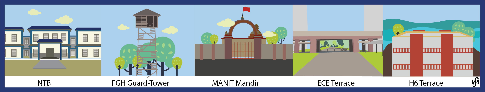

As the Beatles once famously asked; “All the lonely people, where do they all come from? Where do they all belong?”

Fifty years on, and nobody is any closer to the answer, but there is, to some extent, a sort of perverse pleasure in being alone and cut off from the world. And as far as MANIT is concerned, there are a fair few places where people are rather hard to find. Read on, to see where…..

# NTB

The new teaching block is huge. And when I say huge, I mean freaking humungous. You could probably hold classes for every year in every branch in this building, and there would still be about half of it left empty. You could fairly reasonably conclude from that, that this massive monstrosity would bear a deserted look more often than not. And you’d be right.

Look deep enough, and you’ll find empty classrooms and seemingly haunted corridors, disgusting mushrooms and a pack of hungry dogs with a heightened sense of smell. All in all, a wonderful place to be alone.

# FGH GUARD TOWER

As for as guard towers are concerned. It is just the right amount of creepy with a sight tinge of scary. Creaky steps lead up to a usually unmanned post with a rather underwhelming view (or not, depending on whether you liked Slumdog Millionaire). However, its aesthetic (un)pleasantness notwithstanding, it does serve the purpose of giving you a place to dump your thoughts without the fear of running into another living being. Fair warning though those with a fear of heights should steer well clear of this spot.

# MANIT MANDIR

No, it doesn't have anything to do with religious redemption. In fact, it doesn’t have anything to do with the temple either, but more with the area surrounding it, which is filled with dilapidated houses, cows, little kids playing, more cows, cow dung, and a road so narrow that you'd find it rather difficult to do a U-turn on your 2-wheeler.

It’s quiet despite all the sounds, and empty despite all the people. It's a desolate place, perfect for your thoughts.

# ECE TERRACE

This place isn't as well know, outside the ECE department (probably not even within the department), and that's what makes it perfect for a leisurely stroll, or for quiet contemplation.

You can lie down, and let the sun burn you. You can sit down, stare into the seemingly incomprehensible abyss, and listen to Steve Wilson murmuring 'did you ever imagine the last thing you'd hear as you were fading out, was a Song’ (although the terrace isn't nearly high enough for you to literally attempt what he’s saying.

It doesn’t exactly sound peaceful and it isn’t, but then again being alone brings out he agitated best in me, so what do I know?

# H6 TERRACE

Terraces are usually great places for constructing inner monologues on the futility of life. However, what makes this place special is an incredible view of the Kaliyasoth Dam, right in front of your eyes serving as a perfect complement to those thoughts. sitting on the edge of the institution, witnessing Bhopal beneath you is the calm we all seek, a temporary escape from the mundane reality surrounding us.

Apart from all these places, if you’re still looking for somewhere else to take your dark and damp emptiness, your fears, your insecurities, your hate, your regrets, your anger and your guilt, you need only to look within, because in the end, that is all we truly have.

