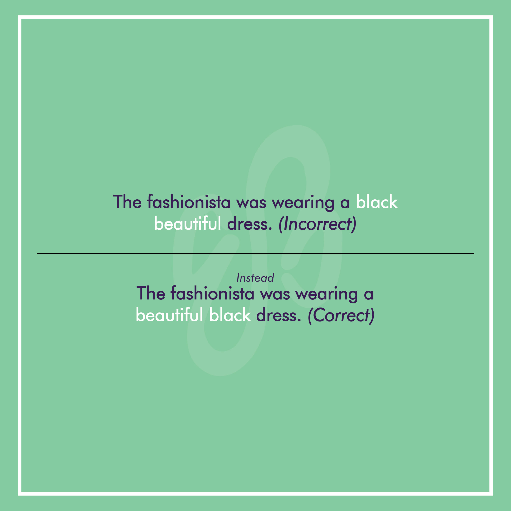
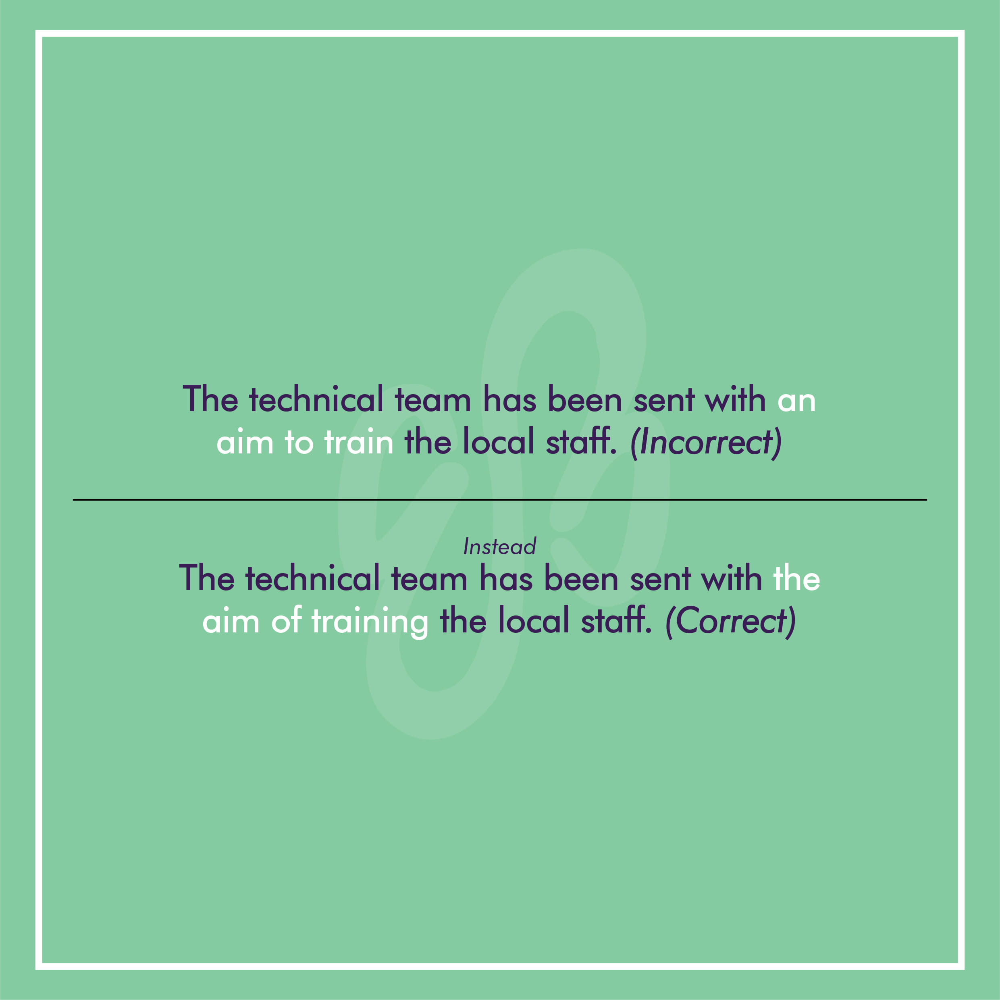
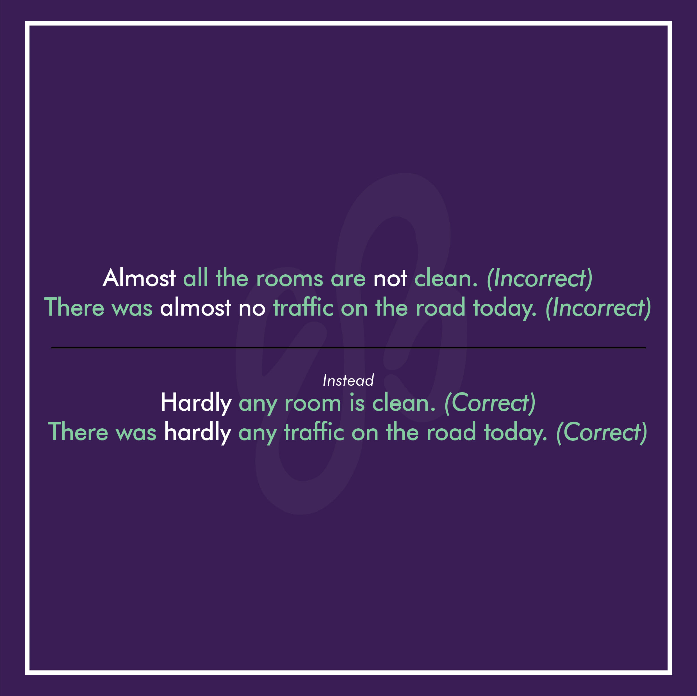
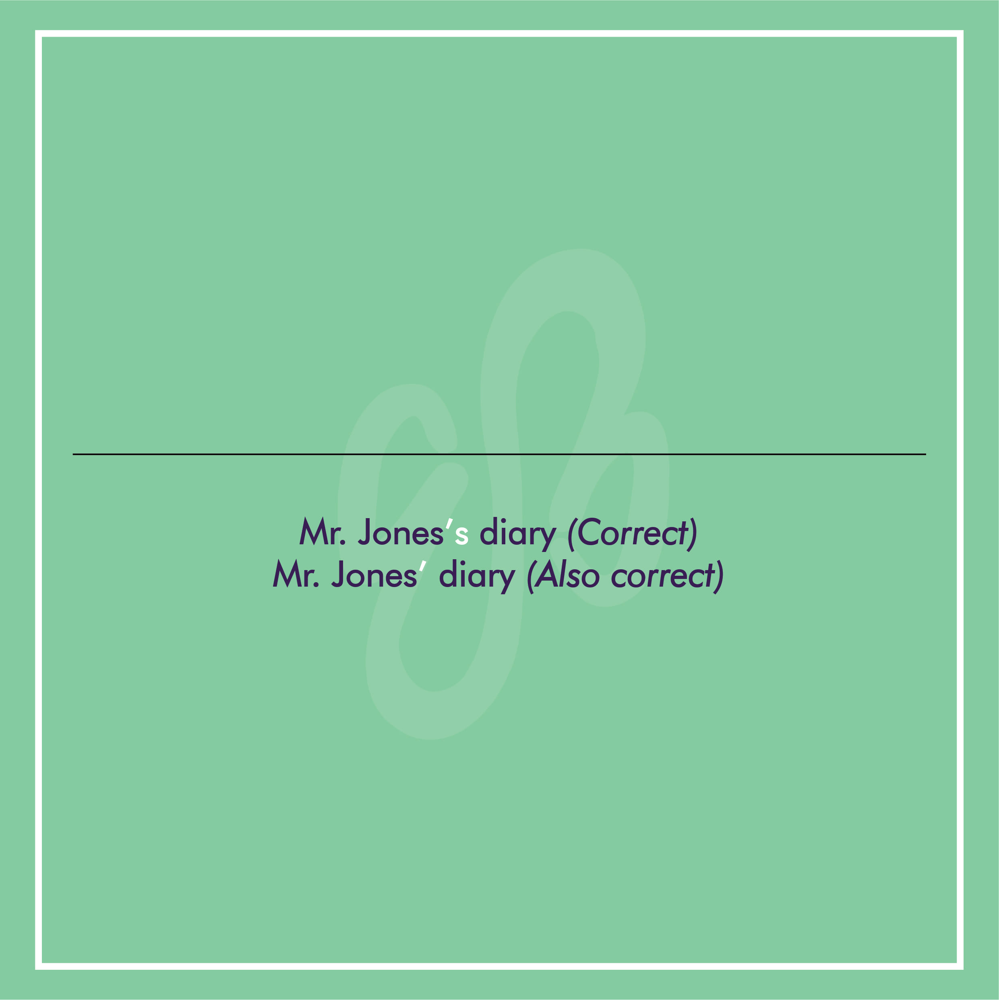
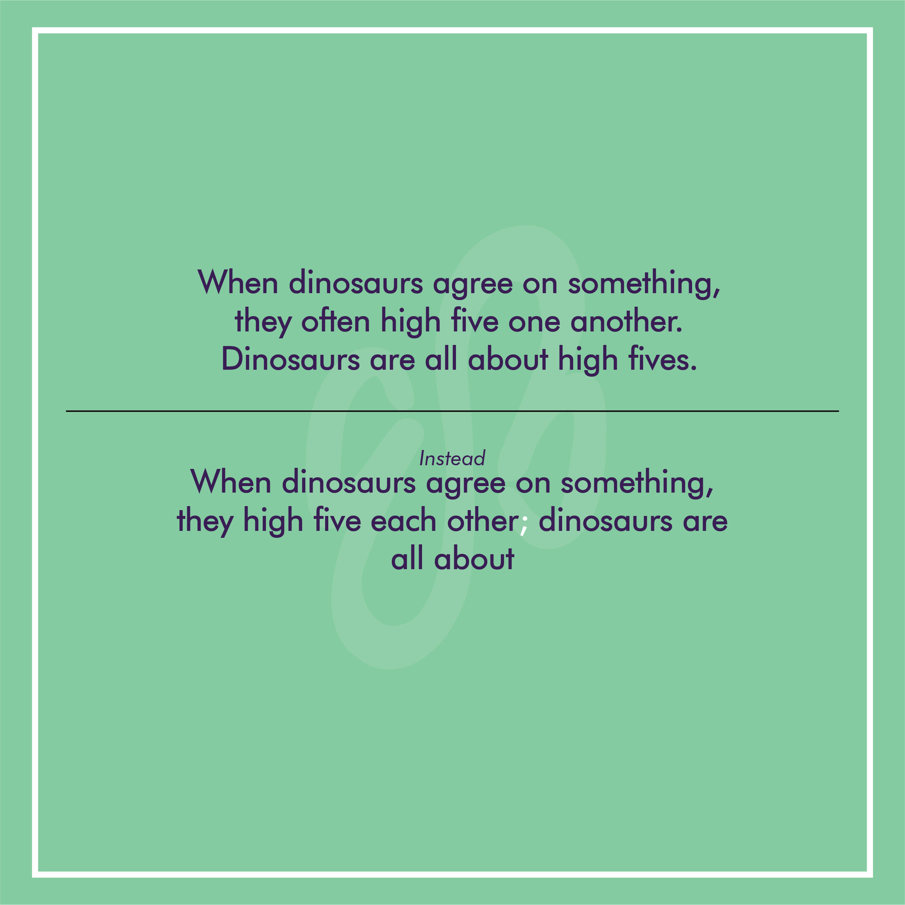

> Grammar is the logic of speech even as logic is the grammar of reason’ **_\-Richard Chenevix Trench._**

To gain command over a language it is essential for us to be well versed with its grammar. Grammar forms the framework of any language. With the endless number of grammatical rules that exist, we are bound to make mistakes once in a while. But some such mistakes can be avoided if we keep the following points in mind.

# The Perplexing Situation Created By A Huge Number Of Adjectives

When we use multiple adjectives before a noun, the ones which express opinions and impressions are normally put before the ones which express facts.

Ex: The fashionista was wearing a black beautiful dress.

The above statement is grammatically incorrect. It should rather be- ‘The fashionista was wearing a beautiful black dress.’

Also, the adjectives which express facts can normally be arranged in the following order.\*

_**SIZE AGE SHAPE COLOUR ORIGIN MATERIAL PURPOSE**_

Ex: He had a big red plastic ball. She owned an old green kitchen table. (\*there maybe some exceptions to that order)

# Advice vs Advise: A Constant Dilemma

While advise and advice do look pretty identical they really aren’t, the former is a verb whereas the latter is a noun. Because of this, they can’t be used interchangeably.

Thus, when you advise someone, you are giving them a piece of advice. Sarah is infamous amongst her peers for giving unsolicited advise. (Incorrect)

Sarah is infamous amongst her peers for giving unsolicited advice. (Correct)

# The Aim Game

An action is taken with the aim of doing something. Thus, while using the word aim, it is preferable to use aim of than aim to, when dealing with an action.

Ex: The technical team has been sent with an aim to train the local staff. (Incorrect)

The technical team has been sent with the aim of training the local staff. (Correct)

# The Negativity Surrounding Almost

Almost is not used with negative words like no, not, nobody etc. in place of it the word hardly can be used.

Ex. : Almost all the rooms are not clean. (Incorrect)

Hardly any room is clean. (Correct)

There was almost no traffic on the road today. (Incorrect)

There was hardly any traffic on the road today. (Correct)

# The Curious Case Of The Apostrophe

Singular cases that end in an s can take either –‘s or –‘. Making both, ‘Mr. Jones’s diary’ and ‘Mr. Jones’ diary’ grammatically correct phrases.

# Confusion Created By The Likes Of _‘Such’_

When we use the word such to introduce the examples of something then it should be used in combination with a noun and the word - as, not like.

Ex : The alleged offences include such crimes like theft and shoplifting.

The above statement may appear to be correct at the first look, but surprisingly enough it isn’t. The correct version would instead be-

The alleged offences include such crimes as theft and shoplifting.

# Internal Punctuation And Combining Sentences

Use a semicolon to connect sentences that contain internal punctuations.

Ex: When dinosaurs agree on something, they often high five one another.

Dinosaurs are all about high fives.

Combining the two we get:

When dinosaurs agree on something, they high five each other; dinosaurs are all about high fives.
